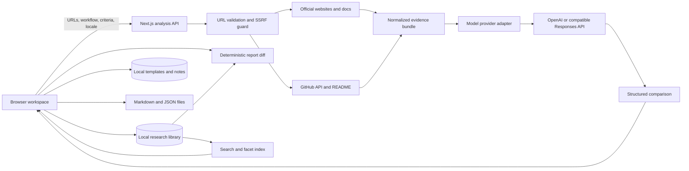
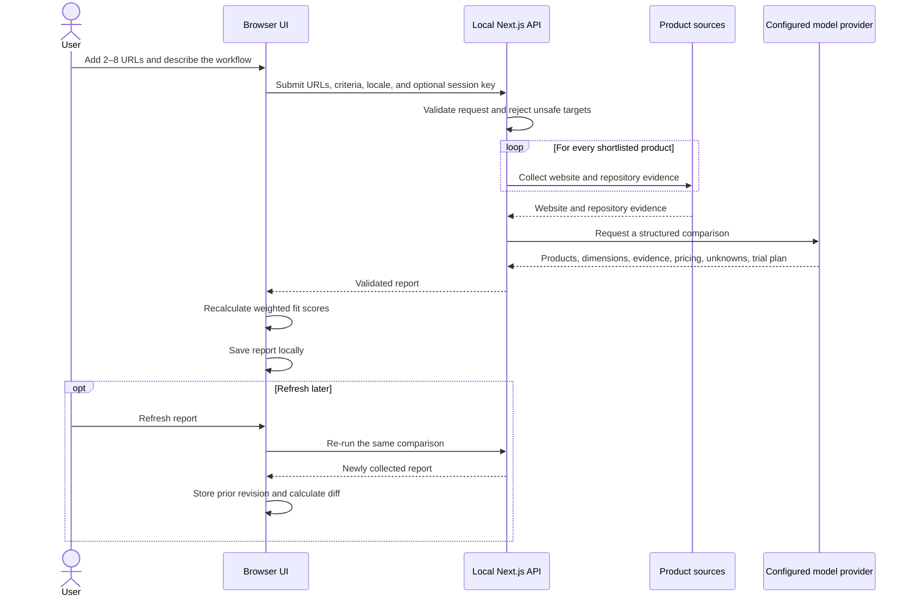
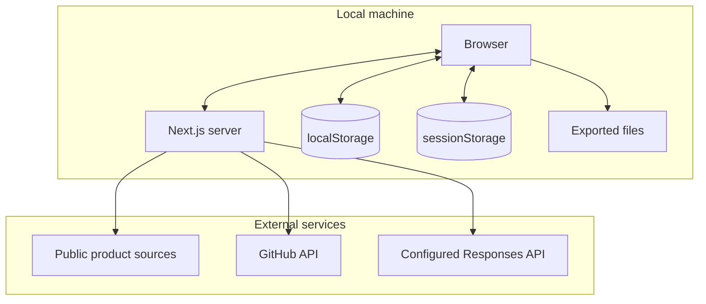
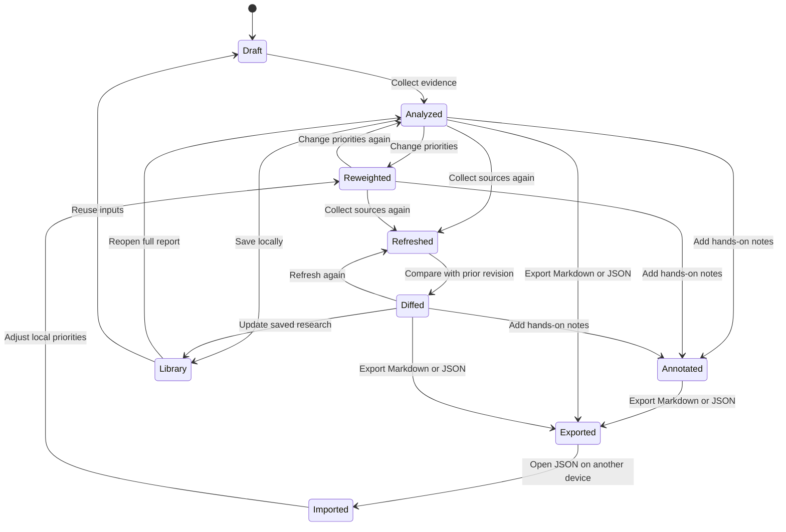
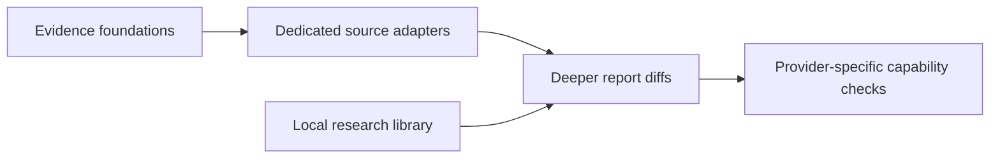

# FitLens

FitLens is a local-first, evidence-aware product comparison tool. It compares
similar products against a person's actual workflow, keeps facts separate from
claims and inference, and explains why one choice is the better fit.

It is designed for decisions where a feature checklist is not enough:
open-source and closed-source products expose different evidence, personal
priorities change the outcome, and important unknowns should remain visible.

## What it does

- Analyzes official product pages and documentation.
- Discovers linked GitHub repositories and collects license, README, and
  repository metadata.
- Separates verified evidence, vendor claims, and explicit inference.
- Detects opposing claims about pricing, accounts, telemetry, source
  availability, offline use, and self-hosting, with direct links to both
  sources.
- Produces a structured recommendation for the user's stated workflow.
- Compares a reorderable shortlist of 2–8 products in one report while keeping
  every score, source, unknown, and trial attached to the right candidate.
- Supports 2–8 editable comparison dimensions with reusable general,
  developer-tool, privacy-first, and everyday-software templates.
- Saves custom comparison templates in the local browser.
- Recalculates the winner immediately when dimension weights change.
- Refreshes an existing report and shows recommendation, score, evidence,
  dimension, and unknown-item changes.
- Supports manual evidence capture for pricing, privacy, screenshots, and
  hands-on findings, with manual evidence preserved across refreshes.
- Turns the suggested trial plan into a saved pass/fail checklist with notes.
- Records evidence capture times and flags aging or stale sources.
- Extracts structured pricing tiers, billing cadence, free availability,
  audience, limits, source strength, and unresolved pricing uncertainty.
- Keeps the five most recent source-report revisions with each report.
- Calibrates confidence from direct verification, source diversity, freshness,
  transparency, and conflicts, and explains every supporting and limiting factor.
- Shows evidence coverage, unknowns, and a short hands-on trial plan.
- Supports Simplified Chinese and English across the interface, analysis,
  validation, dates, and exports.
- Keeps up to 50 reports in a searchable local research library with product,
  source-type, evidence-level, and review-status filters.
- Reopens a prior decision or reuses its URLs, workflow, and criteria as the
  starting point for a new comparison.
- Imports and exports portable JSON reports and exports readable Markdown.
- Creates share-safe Markdown and JSON copies that retain conclusions and
  public evidence while removing private context, notes, trials, revisions,
  criterion hints, and manually entered evidence.
- Uses OpenAI by default, with an opt-in adapter for compatible Responses APIs
  that support structured output.
- Accepts a model API key from `.env.local` or only for the current browser
  session; provider endpoints and credentials never enter saved reports.
- Rejects local, private-network, credential-bearing, and non-HTTP URLs, checks
  every redirect, and caps the bytes read from each remote response.

## Quick start

Requirements:

- Node.js 20.9 or newer
- pnpm 10
- An OpenAI API key, or a local compatible structured-output Responses server,
  for live comparisons

```bash
pnpm install --frozen-lockfile
pnpm dev
```

Open `http://localhost:3000`.

Enter an OpenAI API key in the interface, or create `.env.local`:

```dotenv
OPENAI_API_KEY=
OPENAI_MODEL=gpt-5.6-luna
GITHUB_TOKEN=
```

`GITHUB_TOKEN` is optional and increases GitHub API rate limits.

### Model provider configuration

OpenAI is the default provider. The existing browser session key overrides
`OPENAI_API_KEY` for the current tab session, while `OPENAI_MODEL` selects the
model:

```dotenv
OPENAI_API_KEY=
OPENAI_MODEL=gpt-5.6-luna
```

To use a compatible implementation of the Responses API, configure it only on
the local Next.js server:

```dotenv
FITLENS_MODEL_PROVIDER=compatible
FITLENS_MODEL_BASE_URL=http://127.0.0.1:11434/v1
FITLENS_MODEL_MODEL=your-structured-output-model
FITLENS_MODEL_API_KEY=
```

The compatible endpoint must implement the Responses API and JSON Schema
structured output. A session key entered in the UI also overrides
`FITLENS_MODEL_API_KEY`, without changing the existing browser workflow.

Remote endpoints must use HTTPS. Plain HTTP is deliberately allowed only for
`localhost`, `127.0.0.1`, and `::1`, so a model server on the same machine can
remain simple. Base URLs containing credentials, query parameters, or fragments
are rejected; put credentials in the key setting instead. FitLens does not send
provider configuration to the browser or include it in reports and exports.

## System architecture



The model produces one shared report schema for every product in the shortlist.
The browser owns the interactive weighting step, so changing a weight does not
require another model request. Refreshing does collect the sources again, while
the result-to-result diff is calculated deterministically in the browser.

## Analysis sequence



## Evidence model

FitLens does not treat every public statement as equally reliable.

| Level | Meaning | Typical source |
| --- | --- | --- |
| Verified | Directly checkable public evidence | Source code, license, repository metadata, README |
| Vendor | A claim made by the product owner | Official website or documentation |
| Inferred | A bounded conclusion drawn from available material | Missing public links, likely workflow implications |

An inference must stay labeled as inference. Not finding a capability is not
the same as proving it does not exist.

Evidence coverage is separate from product fit. The current coverage indicator
combines:

- evidence quantity and evidence level: 60%
- distinct source URLs: 25%
- availability of public implementation evidence: 15%

A closed-source product can still be the best fit, but the report should make
its lower observability visible.

### Confidence calibration

Confidence is calculated independently from product fit and does not use the
model's self-reported certainty. The deterministic calibration rewards directly
verified evidence, corroboration across distinct URLs, fresh sources, and
inspectable public implementation. It applies explicit penalties when a product
has only one source, no directly verified evidence, inference-heavy evidence, or
contradictory claims.

Each product shows the calibrated score and band alongside the exact evidence
mix and the factors that raised or limited confidence. The same breakdown is
retained in browser history and portable JSON, and rendered in Markdown exports.
This makes a high-fit, low-confidence recommendation visibly different from a
well-verified recommendation.

FitLens also runs a deterministic consistency check across evidence for each
product. Contradictory claims are paired in the report, assigned a review
priority based on their evidence levels, and retained in local history and
exports. The check is intentionally a warning rather than an automatic verdict:
the user can follow both source links and decide which statement is newer and
better supported.

## Pricing model

Pricing is stored as evidence-backed data rather than flattened into a single
number. Each product can include whether a free option is known, a short
summary, zero or more published plans, and an explicit uncertainty note. A plan
keeps its published price text, billing cadence, intended audience, important
limits, source URL, and evidence level. Missing public pricing stays unknown;
the analysis is instructed not to infer amounts.

This structure is retained in browser history, report revisions, portable JSON,
and Markdown exports. Older reports without structured pricing remain valid.

## Scoring

For product `p` and dimension `d`:

```text
fit(p) = Σ(weight[d] × score[p,d]) / Σ(weight[d])
```

- Each weight is between 0 and 100.
- A comparison contains 2–8 dimensions.
- A report contains a reorderable shortlist of 2–8 products.
- Each product receives a 0–100 score for every selected dimension.
- The model explains each dimension score.
- The browser recomputes normalized totals whenever a slider changes.
- A fit score describes suitability for this workflow, not universal product
  quality.

Dimension keys remain stable inside a report while names, descriptions, and
weights are editable. The analysis response is checked against the submitted
criteria, then normalized back to the exact requested keys, labels, and
weights. This prevents a model response from silently changing the scoring
contract.

## Privacy and data boundaries



| Data | Location | Persistence |
| --- | --- | --- |
| Research library, revisions, notes, custom templates | `localStorage` | Until cleared by the user |
| Key entered in the interface | `sessionStorage` | Current browser session |
| Key configured in `.env.local` | Local server environment | Until the file changes |
| Product source material | Sent to the configured model provider | Governed by the provider account or local server |
| JSON and Markdown exports | User-selected local files | Controlled by the user |
| Share-safe exports | User-selected local files | Private research is removed before download |
| Locale | `localStorage` and optional `?lang=` query | Until changed |

API keys, model names, and provider base URLs are excluded from report history,
notes, JSON, Markdown, and source files. `.env.local` is ignored by Git and the
server reads provider settings only when handling analysis requests.

Share-safe exports provide an additional privacy boundary for reports sent to
other people. They keep the recommendation, scores, pricing, criteria labels
and weights, unknowns, and collected public evidence. They omit the original
workflow context, research notes, trial plans and results, revision history,
criterion hints, and all manually entered evidence. Regular exports remain
complete local backups and should be treated as private.

### Remote source security boundary

Before each website, GitHub API, or redirect request, FitLens resolves the
hostname and rejects the request if any returned IPv4 or IPv6 address is
private, loopback, link-local, reserved, multicast, or unspecified. Redirects
are followed manually, limited to five hops, and checked using the same policy.
Responses must use an expected HTML, JSON, or text content type, and FitLens
stops streaming a response once its route-specific byte limit is exceeded.

This is application-layer SSRF hardening, not a network sandbox. Node's built-in
`fetch` performs its own connection lookup after the policy lookup, so a hostile
DNS service could theoretically change its answer between those two operations
(DNS rebinding). Run FitLens as an unprivileged local process without access to
sensitive network services. Deployments with stronger isolation requirements
should also enforce outbound firewall or proxy rules; the app is intended for
local use, not as a publicly exposed URL-fetching service.

## Local report lifecycle



Portable reports include a schema version, original locale, input URLs,
workflow context, criteria, structured result, confidence calibration,
revision history, notes, and timestamps. Import validation only accepts HTTP
and HTTPS evidence links.
Version 1 files and browser history are migrated to the dynamic criteria model
when loaded.

## Local research library

The browser derives a lightweight search index directly from saved reports, so
searching never sends research data to a server. Search covers workflow context,
product names, source URLs, evidence claims, recommendation reasons, unknowns,
hands-on notes, and the current decision. Facets can narrow the library by a
specific recurring product, open-source or website-only evidence, evidence
level, and whether conflicts or unknowns still need review.

The library reuses the existing `fitlens-report-history-v1` storage key. Older
local history therefore loads without a manual migration, while new history can
retain up to 50 reports instead of six. Opening restores the complete report;
reusing inputs restores only the URLs, workflow, locale, and criteria so the
same research question can be run again with fresh evidence.

## Internationalization

- Supported locales: `zh-CN` and `en`
- Language selection is persisted locally.
- `?lang=en` and `?lang=zh-CN` override the stored language.
- The selected locale is sent with new analysis requests.
- Saved reports keep the language in which they were generated.
- Dictionary keys are type-checked and covered by tests.

## Project structure

```text
app/
  api/analyze/route.ts   Request validation and analysis orchestration
  layout.tsx             Application metadata and root document
components/
  compare-workbench.tsx  Local interactive workspace
lib/
  analyzer.ts            Structured model analysis
  criteria.ts            Localized built-in templates and criteria migration
  confidence.ts          Deterministic confidence calibration and factor breakdown
  conflicts.ts           Deterministic evidence-conflict detection
  diff.ts                Deterministic report-to-report comparison
  evidence.ts            Manual evidence merge and refresh preservation
  freshness.ts           Evidence age classification and summaries
  i18n.ts                Typed Chinese and English dictionaries
  model-provider.ts      Provider config, Responses adapter, and safe diagnostics
  research-library.ts    Local report indexing, search, facets, and summaries
  report.ts              Versioned reports, migration, and evidence coverage
  scoring.ts             Preference-weighted scoring
  source.ts              Website and GitHub evidence collection
  types.ts               Shared request and report types
docs/                    Research and product documentation
test/                    i18n, report, scoring, and URL-safety tests
```

## Development

```bash
pnpm test
pnpm lint
pnpm build
pnpm audit --prod
```

Dependency resolution is locked with `pnpm-lock.yaml`. Project-level pnpm
security settings and the PostCSS override live in `pnpm-workspace.yaml`.

## Product roadmap

The current foundation includes editable comparison criteria, reusable
templates, report refresh, local revision history, deterministic change
summaries, manual evidence capture, trial scoring, and source freshness.
It also includes evidence conflict detection, structured pricing comparison,
deterministic confidence calibration, and bilingual report output.
Reports can also be exported as bilingual share-safe copies without private
research details. A searchable local research library makes saved products,
evidence, decisions, and comparison inputs reusable. The model boundary keeps
OpenAI as the default while allowing a locally configured compatible
structured-output Responses endpoint.

The most valuable next changes, ordered by product impact:

| Priority | Feature | Why it matters | Relative effort |
| --- | --- | --- | --- |
| P1 | Dedicated source adapters | Collects richer pricing, changelog, release, privacy, and documentation evidence | Medium |

### Recommended implementation order



Dedicated source adapters are the strongest next step because they can make
freshness and evidence collection more reliable for pricing, changelogs,
privacy policies, and release history.

## Current constraints

- A report compares 2–8 products; larger discovery sets should be narrowed
  before analysis to keep evidence review practical.
- Source collection begins with one official page and at most one discovered
  GitHub repository per product.
- JavaScript-heavy pages may expose less text to the current HTML collector.
- Dimension scores are model-generated and should be treated as explainable
  judgments, not measurements.
- A report retains at most five prior revisions in local history and exports.
- The 50-report research library is local to one browser unless exported.
- Live analysis requires the user's own API credentials, except for an
  unauthenticated compatible provider bound to a loopback address.
- Compatible providers vary: the configured model must support the Responses
  API and JSON Schema structured output used by FitLens.

## License

FitLens is released under the [MIT License](LICENSE).
