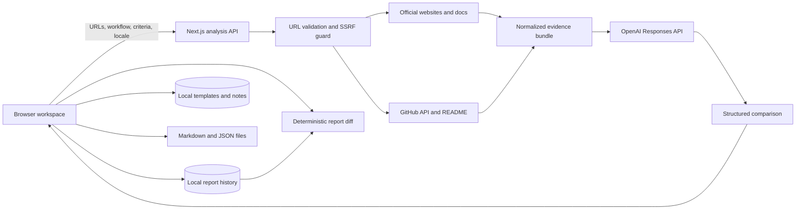
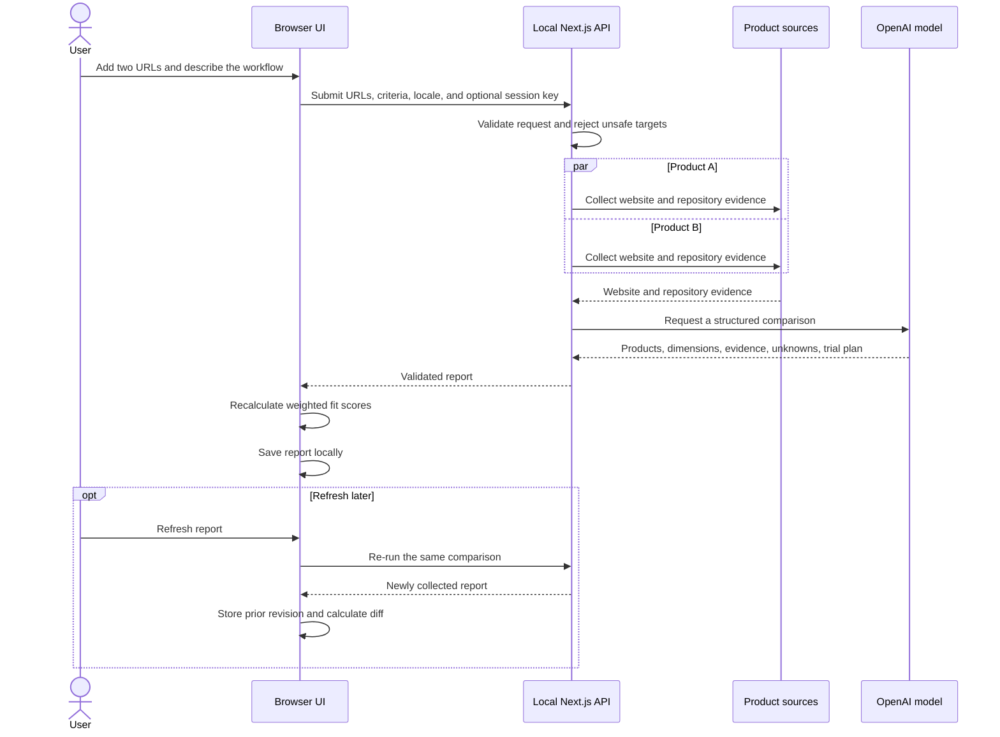
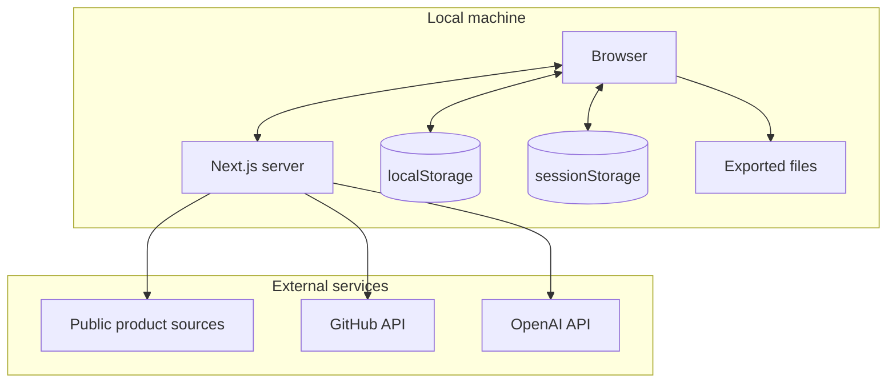
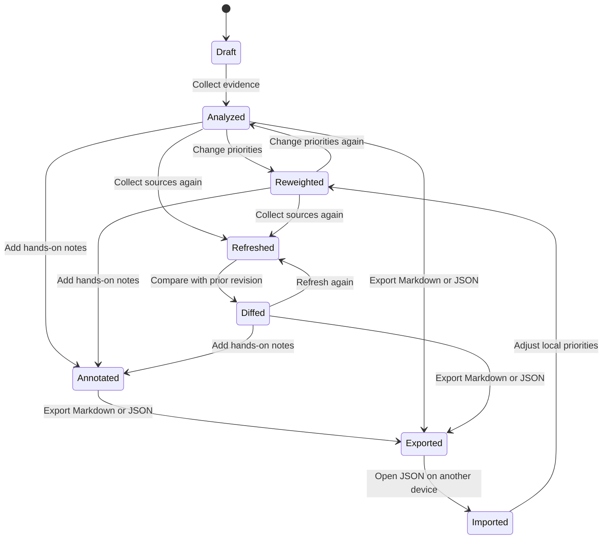
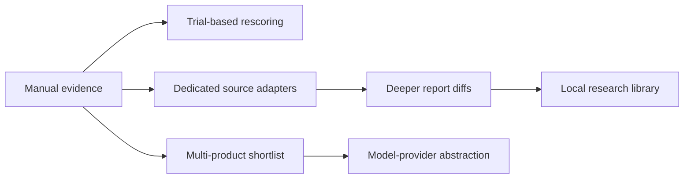

# FitLens

FitLens is a local-first, evidence-aware product comparison tool. It compares
similar products against a person's actual workflow, keeps facts separate from
claims and inference, and explains why one choice is the better fit.

It is designed for decisions where a feature checklist is not enough:
open-source and closed-source products expose different evidence, personal
priorities change the outcome, and important unknowns should remain visible.

## What it does

- Analyzes official product pages and documentation.
- Discovers linked GitHub repositories and collects license, README, and
  repository metadata.
- Separates verified evidence, vendor claims, and explicit inference.
- Produces a structured recommendation for the user's stated workflow.
- Supports 2–8 editable comparison dimensions with reusable general,
  developer-tool, privacy-first, and everyday-software templates.
- Saves custom comparison templates in the local browser.
- Recalculates the winner immediately when dimension weights change.
- Refreshes an existing report and shows recommendation, score, evidence,
  dimension, and unknown-item changes.
- Supports manual evidence capture for pricing, privacy, screenshots, and
  hands-on findings, with manual evidence preserved across refreshes.
- Keeps the five most recent source-report revisions with each report.
- Shows confidence, evidence coverage, unknowns, and a short hands-on trial
  plan.
- Supports Simplified Chinese and English across the interface, analysis,
  validation, dates, and exports.
- Keeps recent reports, research notes, and comparison templates in the local
  browser.
- Imports and exports portable JSON reports and exports readable Markdown.
- Accepts an OpenAI API key from `.env.local` or only for the current browser
  session.
- Rejects local, private-network, credential-bearing, and non-HTTP URLs.

## Quick start

Requirements:

- Node.js 20.9 or newer
- pnpm 10
- An OpenAI API key for live comparisons

```bash
pnpm install --frozen-lockfile
pnpm dev
```

Open `http://localhost:3000`.

Enter an OpenAI API key in the interface, or create `.env.local`:

```dotenv
OPENAI_API_KEY=
OPENAI_MODEL=gpt-5.6-luna
GITHUB_TOKEN=
```

`GITHUB_TOKEN` is optional and increases GitHub API rate limits.

## System architecture



The model produces one shared report schema for both products. The browser
owns the interactive weighting step, so changing a weight does not require
another model request. Refreshing does collect the sources again, while the
result-to-result diff is calculated deterministically in the browser.

## Analysis sequence



## Evidence model

FitLens does not treat every public statement as equally reliable.

| Level | Meaning | Typical source |
| --- | --- | --- |
| Verified | Directly checkable public evidence | Source code, license, repository metadata, README |
| Vendor | A claim made by the product owner | Official website or documentation |
| Inferred | A bounded conclusion drawn from available material | Missing public links, likely workflow implications |

An inference must stay labeled as inference. Not finding a capability is not
the same as proving it does not exist.

Evidence coverage is separate from product fit. The current coverage indicator
combines:

- evidence quantity and evidence level: 60%
- distinct source URLs: 25%
- availability of public implementation evidence: 15%

A closed-source product can still be the best fit, but the report should make
its lower observability visible.

## Scoring

For product `p` and dimension `d`:

```text
fit(p) = Σ(weight[d] × score[p,d]) / Σ(weight[d])
```

- Each weight is between 0 and 100.
- A comparison contains 2–8 dimensions.
- Each product receives a 0–100 score for every selected dimension.
- The model explains each dimension score.
- The browser recomputes normalized totals whenever a slider changes.
- A fit score describes suitability for this workflow, not universal product
  quality.

Dimension keys remain stable inside a report while names, descriptions, and
weights are editable. The analysis response is checked against the submitted
criteria, then normalized back to the exact requested keys, labels, and
weights. This prevents a model response from silently changing the scoring
contract.

## Privacy and data boundaries



| Data | Location | Persistence |
| --- | --- | --- |
| Reports, revisions, notes, custom templates | `localStorage` | Until cleared by the user |
| Key entered in the interface | `sessionStorage` | Current browser session |
| Key configured in `.env.local` | Local server environment | Until the file changes |
| Product source material | Sent to the configured OpenAI model | Governed by the API account |
| JSON and Markdown exports | User-selected local files | Controlled by the user |
| Locale | `localStorage` and optional `?lang=` query | Until changed |

API keys are excluded from report history, notes, JSON, Markdown, and source
files.

## Local report lifecycle



Portable reports include a schema version, original locale, input URLs,
workflow context, criteria, structured result, revision history, notes, and
timestamps. Import validation only accepts HTTP and HTTPS evidence links.
Version 1 files and browser history are migrated to the dynamic criteria model
when loaded.

## Internationalization

- Supported locales: `zh-CN` and `en`
- Language selection is persisted locally.
- `?lang=en` and `?lang=zh-CN` override the stored language.
- The selected locale is sent with new analysis requests.
- Saved reports keep the language in which they were generated.
- Dictionary keys are type-checked and covered by tests.

## Project structure

```text
app/
  api/analyze/route.ts   Request validation and analysis orchestration
  layout.tsx             Application metadata and root document
components/
  compare-workbench.tsx  Local interactive workspace
lib/
  analyzer.ts            Structured model analysis
  criteria.ts            Localized built-in templates and criteria migration
  diff.ts                Deterministic report-to-report comparison
  i18n.ts                Typed Chinese and English dictionaries
  report.ts              Versioned reports, migration, and evidence coverage
  scoring.ts             Preference-weighted scoring
  source.ts              Website and GitHub evidence collection
  types.ts               Shared request and report types
docs/                    Research and product documentation
test/                    i18n, report, scoring, and URL-safety tests
```

## Development

```bash
pnpm test
pnpm lint
pnpm build
pnpm audit --prod
```

Dependency resolution is locked with `pnpm-lock.yaml`. Project-level pnpm
security settings and the PostCSS override live in `pnpm-workspace.yaml`.

## Product roadmap

The current foundation includes editable comparison criteria, reusable
templates, report refresh, local revision history, deterministic change
summaries, and manual evidence capture.

The most valuable next changes, ordered by product impact:

| Priority | Feature | Why it matters | Relative effort |
| --- | --- | --- | --- |
| P1 | Multi-product shortlist | Supports discovery workflows where the user begins with more than two candidates | High |
| P1 | Dedicated source adapters | Collects richer pricing, changelog, release, privacy, and documentation evidence | Medium |
| P1 | Trial checklist with post-trial rescoring | Turns suggested tests into recorded outcomes that can affect the final decision | Medium |
| P2 | Searchable local research library | Makes prior decisions and recurring products reusable instead of isolated reports | Medium |
| P2 | Model-provider abstraction | Lets local users choose another structured-output provider without changing the evidence pipeline | High |

### Recommended implementation order



Manual evidence capture is the strongest next step because it closes the
largest information gap for products whose useful evidence is not available
through a public repository or a server-rendered product page.

## Current constraints

- A report compares exactly two products.
- Source collection begins with one official page and at most one discovered
  GitHub repository per product.
- JavaScript-heavy pages may expose less text to the current HTML collector.
- Dimension scores are model-generated and should be treated as explainable
  judgments, not measurements.
- A report retains at most five prior revisions in local history and exports.
- Reports are local to one browser unless exported.
- Live analysis requires the user's own API credentials.

## License

FitLens is released under the [MIT License](LICENSE).
