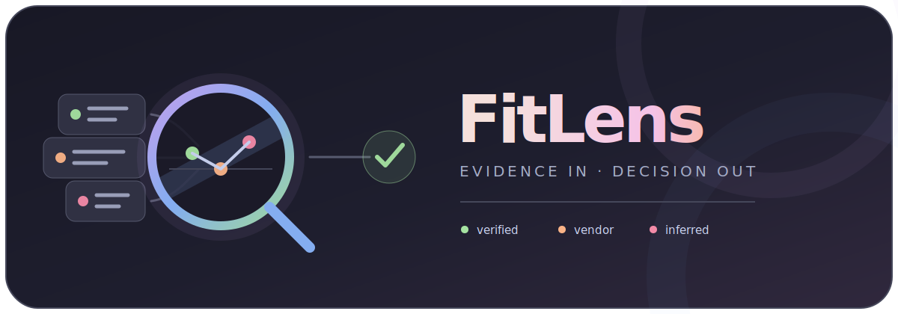
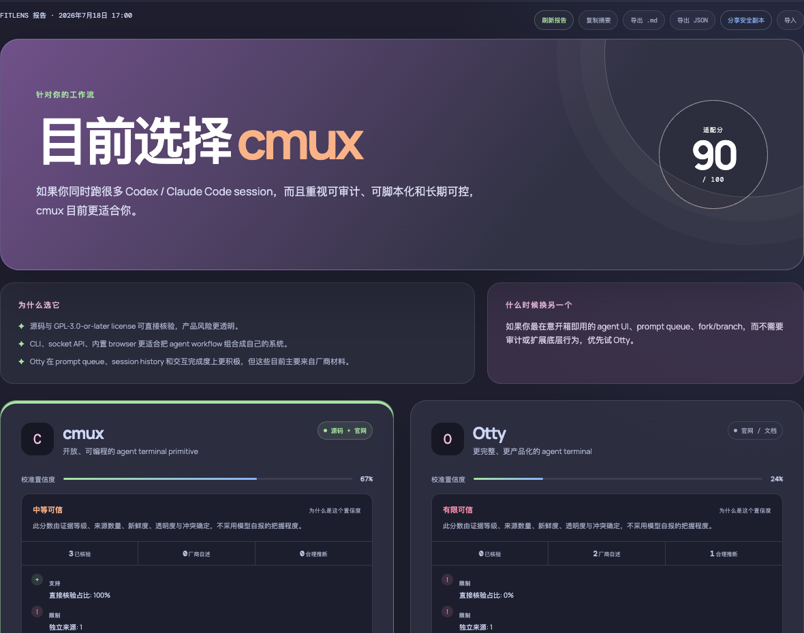
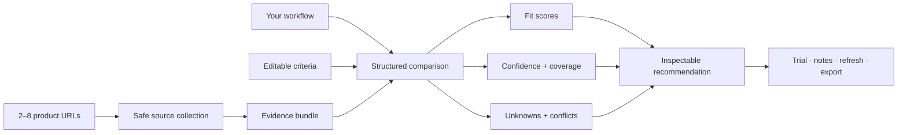
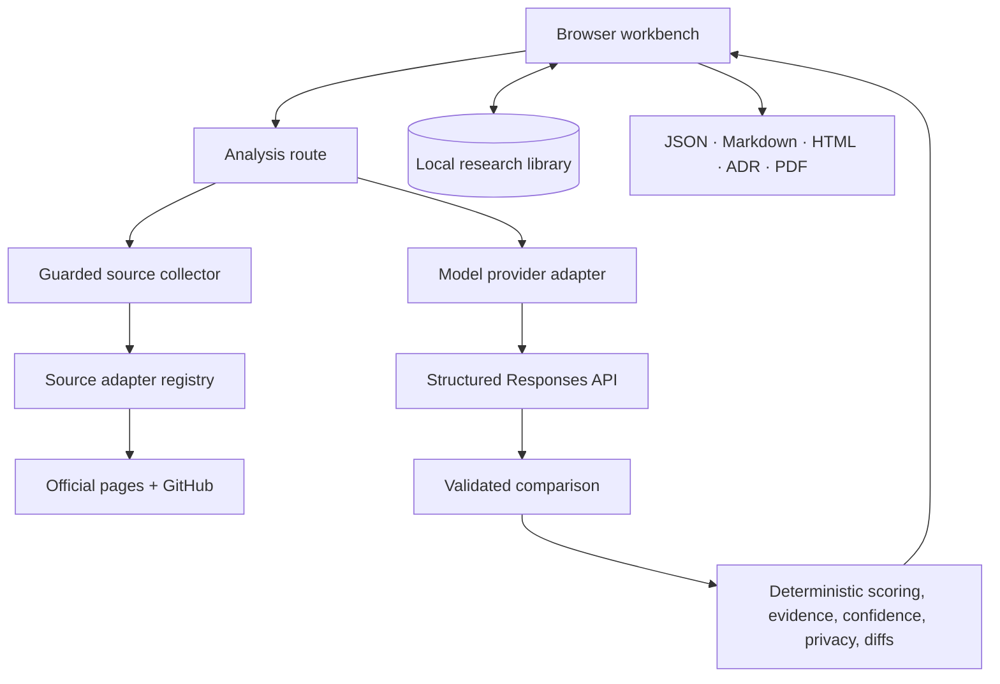

<p align="center">
  <a href="assets/fitlens-logo.svg">
    
  </a>
</p>

<h1 align="center">FitLens</h1>

<p align="center">
  <strong>Compare products by evidence, not feature-count theater.</strong>
</p>

<p align="center">
  FitLens researches 2–8 similar products, separates facts from claims and
  inference, then scores the shortlist against the way you actually work.
</p>

<p align="center">
  
  
  
  <a href="LICENSE"></a>
</p>

<p align="center">
  <a href="#quick-start">Quick start</a> ·
  <a href="#how-a-decision-works">How it works</a> ·
  <a href="#evidence-not-vibes">Evidence model</a> ·
  <a href="#local-by-design">Privacy</a> ·
  <a href="docs/ARCHITECTURE.md">Architecture</a>
</p>

---

Product pages are written to persuade you. FitLens is built to help you decide.

Give it product URLs, your workflow, and the criteria that matter. It collects
official pages, documentation, and linked GitHub repositories; keeps verified
facts separate from vendor claims and bounded inference; makes unknowns
visible; and produces a recommendation you can inspect, reweight, test, save,
refresh, and export.

<p align="center">
  
</p>

## Highlights

| | |
| --- | --- |
| **Research a shortlist** | Compare 2–8 products in one report. Reorder candidates without losing their evidence, scores, pricing, privacy findings, or trial results. |
| **Read official registries** | Enrich npm, PyPI, Apple App Store, and Chrome Web Store listings with normalized versions, requirements, licensing, release, rating, and repository signals when published. |
| **Keep a candidate inbox** | Paste product links as you discover them, add notes and tags, search or archive them, then promote any 2–8 candidates into a comparison without fetching a page. |
| **See the evidence quality** | Every claim is labeled `verified`, `vendor`, or `inferred`. Coverage, freshness, source diversity, contradictions, and calibrated confidence are separate signals. |
| **Review before trusting** | Accept, reject, edit, and annotate individual claims. Rejected evidence stops affecting confidence, coverage, freshness, and conflict checks without erasing the audit trail. |
| **Decide for your workflow** | Use editable criteria and reusable templates. Reweight the decision instantly without another model request. |
| **Reuse how you decide** | Save complete decision profiles with workflow context and criteria, then apply them to the next product category. |
| **Keep the messy parts visible** | Pricing uncertainty, missing disclosures, conflicting claims, and source failures stay explicit instead of being smoothed into a confident answer. |
| **Build a local research memory** | Search and filter up to 50 saved reports. Reopen a decision, reuse its inputs, add manual evidence, refresh sources, and review deterministic diffs. |
| **Keep a durable decision record** | Export JSON, Markdown, self-contained HTML, an ADR, or a print-optimized PDF; share-safe copies remove private context, notes, trials, revisions, and manual evidence. |

## Quick start

Requires Node.js 20.9+, pnpm 10, and an API key for live analysis.

```bash
git clone https://github.com/wp043/fitlens.git
cd fitlens
pnpm install --frozen-lockfile
pnpm dev
```

Open `http://localhost:3000`.

The bundled cmux/Otty report works without an API key. For a live comparison,
enter a key for the current browser session or create `.env.local`:

```dotenv
OPENAI_API_KEY=
OPENAI_MODEL=gpt-5.6-luna
GITHUB_TOKEN=
FITLENS_BROWSER_FALLBACK=0
```

`GITHUB_TOKEN` is optional; it only raises GitHub API rate limits.
`FITLENS_BROWSER_FALLBACK=1` opts into rendering thin JavaScript application
shells. Install the matching local browser once with:

```bash
pnpm exec playwright install chromium
```

Static HTML remains the default. The renderer starts only when the initial page
has very little readable text and recognizable application-shell markers. It
blocks media, fonts, WebSockets, service workers, non-GET requests, oversized
responses, and excessive request counts; scripts and data requests are fetched
through the same public-address and redirect policy as the static collector.
If rendering is unavailable or produces less content, FitLens keeps the static
result.

## How a decision works



1. FitLens validates every candidate URL, collects its official page or
   supported registry/store metadata, follows
   high-value links for pricing, documentation, privacy, security, and release
   history, then inspects one linked GitHub repository when available.
2. The configured model turns those sources into one strict report schema. It
   cannot add criteria, omit products, or silently invent source URLs.
3. Deterministic local code recalculates weighted fit, evidence coverage,
   freshness, conflicts, privacy risk, and confidence.
4. The browser stores the report locally. Refreshing collects new sources and
   produces a field-level diff against the previous revision.

If one candidate cannot be collected, the model is not called. FitLens marks
the affected row, preserves the draft, and lets you correct the URL or retry.

## Three signals, not one magic score

| Signal | Question it answers | Source |
| --- | --- | --- |
| **Fit** | How well does this product match this workflow and these priorities? | Model dimension judgments + local weighted calculation |
| **Confidence** | How much should I trust the available evidence? | Deterministic calibration from verification, diversity, freshness, transparency, and conflicts |
| **Coverage** | How much useful public evidence did FitLens find? | Deterministic evidence quantity, level, source count, and implementation visibility |

A closed-source product can have high fit and low confidence. An open-source
product can have excellent coverage and still be the wrong tool for your
workflow. FitLens keeps those cases distinct.

## Evidence, not vibes

| Level | What it means | Typical source |
| --- | --- | --- |
| **Verified** | Directly checkable public evidence | Source code, license, repository metadata, README |
| **Vendor** | A statement made by the product owner | Official website or documentation |
| **Inferred** | A bounded conclusion from the available material | Missing public links or likely workflow implications |

Not finding a capability is not proof that it does not exist. Inference stays
labeled as inference, published prices remain verbatim, and missing privacy
disclosures remain unknown rather than being interpreted as safe or unsafe.

FitLens also detects opposing claims about pricing, accounts, telemetry, source
availability, offline use, and self-hosting. A conflict is a review prompt, not
an automatic verdict: both sources remain linked so you can decide which is
newer and better supported.

## A research workflow, not a one-shot answer

- Capture hands-on findings, screenshots, pricing checks, and privacy notes as
  manual evidence. Manual entries survive source refreshes.
- Review collected claims in place. Corrections preserve the model's original
  wording, and review status, notes, and edits survive source refreshes.
- Turn the generated trial plan into a saved pass/fail checklist with notes.
- Run the same hands-on task against any two shortlisted products and keep a
  separate win/loss/tie standing that does not pretend to be model evidence.
- Flag aging and stale sources, then refresh the report when the decision
  matters again.
- Search saved research by product, workflow, evidence claim, source URL,
  recommendation, unknown, or note.
- Capture links in a separate local candidate inbox, deduplicate tracking URLs,
  and build a shortlist only when the comparison is worth running.
- Export complete JSON/Markdown backups, offline HTML, architecture decision
  records, print/PDF artifacts, or share-safe copies for someone else.

Portable reports are versioned and validated on import. Existing v1, v2, and v3
reports remain compatible with the current dynamic shortlist and criteria
models.

## Model providers

OpenAI is the default. A session key entered in the UI stays in
`sessionStorage`; a key in `.env.local` stays on the local Next.js server.

FitLens can also use a compatible Responses API with JSON Schema structured
output:

```dotenv
FITLENS_MODEL_PROVIDER=compatible
FITLENS_MODEL_BASE_URL=http://127.0.0.1:11434/v1
FITLENS_MODEL_MODEL=your-structured-output-model
FITLENS_MODEL_API_KEY=
```

Remote compatible endpoints must use HTTPS. Plain HTTP is allowed only for
loopback addresses. Base URLs containing credentials, query parameters, or
fragments are rejected, and provider configuration never enters saved reports.

## CLI and headless use

The CLI runs the same validation, guarded source collector, provider adapter,
and structured analysis service as the browser route:

```bash
pnpm fitlens analyze \
  --url https://product-a.example \
  --url https://product-b.example \
  --context "I need a local-first tool for daily agent workflows." \
  --format markdown \
  --output comparison.md
```

It reads provider credentials from the same environment variables described
above. Use `--criteria criteria.json` for custom criteria, `--context-file
context.txt` for longer workflows, or `pnpm fitlens --help` for the complete
command reference. Built-in `general`, `developer-tools`, `privacy-first`, and
`daily-use` templates are available through `--template`; JSON is the default
stdout format for scripts.

### Watchlists and snapshots

For recurring research, create a local `fitlens.watch.json`:

```json
{
  "version": 1,
  "entries": [
    {
      "id": "terminal-tools",
      "urls": ["https://product-a.example", "https://product-b.example"],
      "context": "I need a local-first terminal for daily agent work.",
      "template": "developer-tools",
      "locale": "en",
      "intervalHours": 168,
      "notifications": "changes"
    }
  ]
}
```

Run due entries manually or from cron/launchd:

```bash
pnpm fitlens watch --config fitlens.watch.json
```

Each successful run writes an immutable timestamped snapshot, `latest.json`, a
bounded `trend.json`, and a self-contained `trend.html` score timeline under
`.fitlens/snapshots/<watch-id>/`, then atomically updates `lastRunAt` in the
config. Snapshots after the first also contain a deterministic change summary.
Set `notifications` to `changes` or `always` for native macOS, Linux, or Windows
alerts; the default is `off`, and an unavailable notification service never
invalidates a successful refresh. Use `--force` to refresh everything regardless
of interval. `.fitlens/` is ignored by Git so research snapshots are not
published accidentally.

## Local by design

FitLens has no account system and no hosted database.

| Data | Where it lives | How long |
| --- | --- | --- |
| Reports, revisions, notes | Browser IndexedDB with `localStorage` fallback | Until you clear it |
| Candidate inbox, notes, tags, archive state | Browser IndexedDB with `localStorage` fallback | Until you clear it |
| Criteria templates, decision profiles, and locale | Browser `localStorage` | Until you clear it |
| Key entered in the UI | Browser `sessionStorage` | Current tab session |
| `.env.local` keys and provider config | Local server environment | Until the file changes |
| Product source material | Configured model provider | According to that provider |
| Markdown and JSON exports | Files you choose | Under your control |

Remote source collection resolves hostnames before every request, rejects
non-public IPv4/IPv6 ranges, validates every redirect, strips credentials on
cross-origin redirects, restricts content types, and caps streamed response
size. This is application-layer SSRF hardening, not a network sandbox; do not
expose FitLens as a public URL-fetching service.

See [Architecture](docs/ARCHITECTURE.md#security-boundaries) for the exact trust
boundaries and invariants.

## Architecture



The important seam is between model judgment and deterministic local logic.
The model produces a constrained comparison; it does not control weighting,
confidence calibration, evidence coverage, conflict detection, persistence,
redaction, or report migration.

Read [docs/ARCHITECTURE.md](docs/ARCHITECTURE.md) for module ownership, data
flows, invariants, persistence, test layers, and deliberate non-goals.

## Project map

```text
app/
  api/analyze/       request orchestration and public error responses
  examples/          bundled no-key comparison
scripts/
  fitlens             headless CLI entry point
components/
  compare-workbench  local interactive research workspace
  candidate-inbox    quick capture, filtering, archive, and shortlist UI
  pairwise-trials    head-to-head trial capture and standings UI
lib/
  source             guarded website and GitHub collection
  source-adapters/   official document and marketplace metadata adapters
  model-provider     provider configuration and structured Responses adapter
  analyzer           prompt, response schema, and cross-field validation
  analysis-service   shared browser and headless orchestration
  cli                deterministic command parsing and help
  markdown-report    portable headless Markdown rendering
  durable-exports    escaped offline HTML and ADR rendering
  watchlist          scheduling, snapshot trends, and offline trend charts
  local-notifications argument-safe native desktop alerts
  scoring            deterministic preference weighting
  confidence         deterministic evidence confidence
  conflicts          opposing-claim detection
  privacy            privacy-risk calibration
  report             portable schema, migration, and coverage
  candidate-inbox    URL capture, normalization, deduplication, and search
  decision-profiles  reusable workflow-and-criteria validation
  pairwise           deterministic trial standings
  persistence        IndexedDB adapter and safe localStorage migration
  research-library   local search index and facets
test/                 deterministic domain and security tests
e2e/                  browser workflows, accessibility, and visual baseline
.github/               CI and dependency maintenance
playwright.config.ts   Chromium test and local server contract
docs/                 architecture and worked product research
```

## Development

```bash
pnpm check
pnpm exec playwright install chromium
pnpm test:e2e
pnpm audit --prod
```

`pnpm check` runs the fast deterministic tests, ESLint, TypeScript, and the
production build. Run those parts individually when iterating:

```bash
pnpm test
pnpm lint
pnpm exec tsc --noEmit
pnpm build
```

The test suite covers scoring, report migration, i18n parity, confidence,
conflicts, privacy, redaction, research search, provider configuration, source
diagnostics, and URL/DNS/redirect safety without requiring live network calls.
Playwright covers candidate capture, evidence review, automated WCAG checks,
and platform-specific full-page visual contracts. GitHub Actions runs the core
quality gate on Linux, macOS, and Windows, with browser contracts and production
dependency auditing on Linux. Dependabot keeps pnpm and workflow dependencies
visible.

## Current limits

- Source collection starts with one official page, follows at most one page per
  supported document kind, and inspects at most one discovered GitHub
  repository plus its latest release per product.
- The opt-in browser fallback does not bypass logins, CAPTCHAs, consent walls,
  or content that requires user interaction.
- Dimension scores are explainable model judgments, not objective measurements.
- Reports and the 50-item research library stay in one browser unless exported.
- A report retains at most five prior revisions.
- Compatible models must implement the Responses API and JSON Schema structured
  output used by FitLens.
- Watchlists require an external local scheduler such as cron or launchd; the
  browser does not claim to run reliable background jobs while it is closed.

Further extensions should preserve the local-first boundary. A useful direction
is richer trend visualization across watch snapshots.

## License

[MIT](LICENSE) © Wendy Pan
