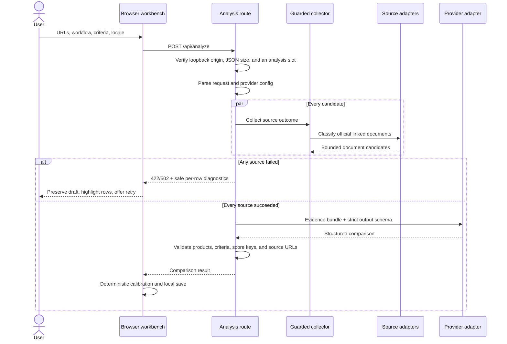
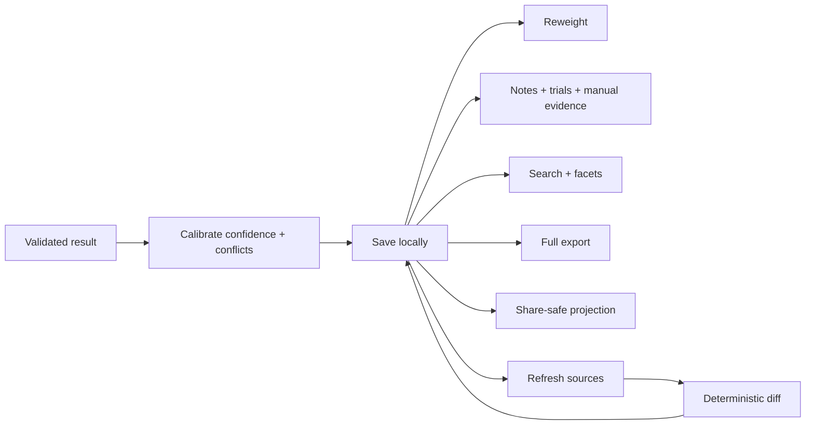

# FitLens architecture

This document is a map of the current codebase: where responsibilities live,
which boundaries matter, and what must remain true when the product changes.

## Contents

1. [System shape](#system-shape)
2. [Module ownership](#module-ownership)
3. [Live analysis flow](#live-analysis-flow)
4. [Local report flow](#local-report-flow)
5. [Core invariants](#core-invariants)
6. [Security boundaries](#security-boundaries)
7. [Persistence](#persistence)
8. [Test layers](#test-layers)
9. [Deliberate non-goals](#deliberate-non-goals)

## System shape

FitLens has four practical layers. Dependencies point down; deterministic
domain modules do not import the UI or route.

```text
┌──────────────────────────────────────────────────────────────┐
│ Browser UI                                                   │
│ app/page.tsx · components/compare-workbench.tsx              │
├──────────────────────────────────────────────────────────────┤
│ Request orchestration                                        │
│ route.ts · analysis-service.ts · analyze-request.ts · CLI     │
├──────────────────────────────────────────────────────────────┤
│ External adapters                                             │
│ lib/source.ts · lib/source-adapters/* · source-diagnostics.ts │
│ lib/model-provider.ts · lib/analyzer.ts                       │
├──────────────────────────────────────────────────────────────┤
│ Deterministic domain + portable data                          │
│ scoring · evidence · confidence · conflicts · privacy · diff │
│ freshness · redaction · report · research-library · types    │
└──────────────────────────────────────────────────────────────┘
```

The browser is intentionally stateful: it owns draft criteria, local history,
notes, trial results, and reweighting. The server and CLI share a narrow
analysis service that validates a request, collects sources, calls the
configured model, validates the structured response, and returns it.

## Module ownership

| Concern | Owner |
| --- | --- |
| Page metadata and root document | `app/layout.tsx` |
| Workbench state and report interactions | `components/compare-workbench.tsx` |
| Candidate capture, filtering, archive, and shortlist interactions | `components/candidate-inbox.tsx` |
| Pairwise trial editing and standings UI | `components/pairwise-trials.tsx` |
| Public analysis endpoint and status codes | `app/api/analyze/route.ts` |
| Loopback request, body-size, JSON, and in-flight policy | `lib/request-guard.ts` |
| Production browser response policy | `lib/security-headers.ts`, `next.config.ts` |
| Shared browser/CLI orchestration and source failure boundary | `lib/analysis-service.ts` |
| Headless argument parsing and entry point | `lib/cli.ts`, `scripts/fitlens.ts` |
| Watchlist validation, due scheduling, snapshot trends, and offline chart rendering | `lib/watchlist.ts` |
| Argument-safe native desktop notifications | `lib/local-notifications.ts` |
| Request schema and URL-list validation | `lib/analyze-request.ts` |
| URL policy, DNS checks, redirects, byte caps, page/GitHub collection | `lib/source.ts` |
| Opt-in guarded JavaScript rendering for thin application shells | `lib/source.ts` |
| Official pricing, docs, privacy, security, and changelog discovery | `lib/source-adapters/registry.ts` |
| npm, PyPI, App Store, and Chrome Web Store metadata normalization | `lib/source-adapters/marketplaces.ts` |
| Per-candidate collection outcomes and safe public failures | `lib/source-diagnostics.ts` |
| Provider env resolution, client construction, normalized provider errors | `lib/model-provider.ts` |
| Model prompt, response schema, and response cross-field validation | `lib/analyzer.ts` |
| Criteria templates and legacy criteria migration | `lib/criteria.ts` |
| Candidate URL normalization, deduplication, storage validation, and search | `lib/candidate-inbox.ts` |
| Decision profile validation | `lib/decision-profiles.ts` |
| Deterministic head-to-head standings | `lib/pairwise.ts` |
| IndexedDB access, ordered writes, migration, and fallback policy | `lib/persistence.ts` |
| Weighted fit calculation | `lib/scoring.ts` |
| Active evidence filtering, manual merge, and review preservation | `lib/evidence.ts` |
| Evidence age classification | `lib/freshness.ts` |
| Deterministic confidence calibration | `lib/confidence.ts` |
| Opposing-claim detection | `lib/conflicts.ts` |
| Privacy risk calibration | `lib/privacy.ts` |
| Report-to-report change calculation | `lib/diff.ts` |
| Share-safe projection | `lib/redaction.ts` |
| Escaped offline HTML and ADR generation | `lib/durable-exports.ts` |
| Portable schemas, migrations, and evidence coverage | `lib/report.ts` |
| Local search index, summaries, and facets | `lib/research-library.ts` |
| Shared data contracts | `lib/types.ts` |
| User-facing Chinese and English strings | `lib/i18n.ts` |

If a new feature is deterministic and useful outside React, it belongs in a
`lib/` module with direct tests. The workbench should coordinate that logic, not
reimplement it.

## Live analysis flow



Source collection is all-or-nothing for analysis. Partial evidence is useful
for diagnostics, but it is not sent to the model because that would create an
uneven comparison without making the omission obvious in the final ranking.

## Local report flow

The model is not involved when a user changes weights, searches saved reports,
adds notes, records trial results, exports a report, or compares revisions.



## Core invariants

These are the contracts most likely to cause subtle errors if weakened:

1. A request and result contain 2–8 products. Every requested source produces
   exactly one returned product in the same order.
2. Criteria keys are stable. A model response must return each requested key
   exactly once; labels and weights are normalized back to the user's input.
3. Every dimension score map contains every product name exactly once. The
   recommendation and dimension winners must reference returned products.
4. Evidence and pricing links are normalized to URLs collected for that
   product. A model cannot introduce an arbitrary citation URL.
5. Missing disclosure remains unknown. It cannot improve privacy risk or
   confidence.
6. Manual evidence survives refreshes and is never duplicated when the model
   later returns the same claim.
7. Rejected evidence stays in the report audit trail but is excluded from
   confidence, coverage, freshness, conflict detection, and decision Markdown.
   Edited claims retain their original model wording and review metadata across
   refreshes.
8. Fit, confidence, and coverage stay separate. Reweighting fit must not change
   confidence or evidence coverage.
9. Share-safe exports are derived copies. They do not mutate the local report
   and do not contain context, notes, trials, revisions, criterion hints, or
   manual evidence.
10. API keys, provider names, models, and provider base URLs never enter report
   history or exports.
11. Old portable reports are migrated at the schema boundary rather than
    scattered through UI code.

## Security boundaries

### Local analysis endpoint

The Next.js process is a single-user loopback application, not a public API.
The mutation route enforces that assumption before it spends a configured model
key or fetches a submitted URL:

- `Host` must be `localhost`, an IPv4 `127/8` address, or IPv6 `::1`.
- `Origin` (or `Referer` when `Origin` is absent) must use the request scheme and
  exactly match that loopback authority. Headerless and cross-origin POSTs fail
  closed; no permissive CORS response is emitted.
- The body must be `application/json`. Declared and streamed bytes are capped at
  64 KB before schema validation.
- At most two source/model analyses may be in flight in one process. A third
  request receives `429` and `Retry-After`; slot release is guaranteed by the
  route's `finally` block.
- Production browser responses use CSP, frame denial, MIME-sniffing protection,
  a no-referrer policy, same-origin opener/resource policies, and a restrictive
  Permissions Policy. HSTS is intentionally absent because local use is HTTP.

The counters are process-local and are not a distributed rate limiter. Binding
the server to a non-loopback interface or placing it behind a proxy changes the
trust model and is unsupported without real authentication and network policy.

### Remote source collection

`lib/source.ts` treats every submitted URL and redirect target as hostile.

- Only HTTP and HTTPS URLs without embedded credentials are accepted.
- DNS is resolved before each request. Any private, loopback, link-local,
  reserved, multicast, or unspecified IPv4/IPv6 answer rejects the host.
- Redirects are manual and capped at five hops.
- Authorization is removed on cross-origin redirects.
- Content type is allowlisted for each route.
- Actual streamed bytes are capped; `Content-Length` alone is not trusted.
- Supplemental documents and GitHub metadata, README, and latest-release
  requests use the same guarded transport.
- npm, PyPI, and Apple listings use their official public JSON endpoints;
  Chrome Web Store evidence is extracted from its guarded public listing because
  it has no equivalent anonymous metadata endpoint.
- Supplemental collection is bounded to one page per recognized kind and
  4,000 extracted characters per page. An optional supplemental-page failure
  does not invalidate a successfully collected homepage.
- Browser rendering is opt-in and only considered for thin application shells.
  Chromium receives the initial HTML offline; external scripts, styles, and
  data are re-fetched through the guarded Node transport, while media, fonts,
  WebSockets, service workers, non-GET requests, and bounded-resource overages
  are blocked. A rendering failure falls back to the original static page.

Each guarded request resolves and validates every DNS answer, then supplies that
same immutable address set to the HTTP connection lookup. Redirects repeat the
process with a fresh, destination-specific dispatcher, closing the DNS-rebinding
window between policy evaluation and socket creation. A public deployment should
still enforce an outbound firewall or proxy as defense in depth.

### Model boundary

The provider adapter accepts OpenAI or an opt-in compatible Responses endpoint.
Remote base URLs require HTTPS; unauthenticated HTTP is allowed only on
loopback. Provider errors are mapped to stable public codes without retaining
upstream bodies, stack traces, or secret-bearing messages.

The model sees the user's workflow, criteria, and collected public source
material. Collected page text, supplemental documents, repository metadata,
and README content are serialized only under `UNTRUSTED_SOURCE_DATA`, separate
from `TRUSTED_USER_REQUIREMENTS`. Provider instructions explicitly forbid those
values from changing rules, scoring, candidate order, or the response schema,
and adversarial tests keep embedded page commands out of the instruction
channel. Structured output and cross-field validation remain the enforcement
layer after generation. Prompt isolation reduces injection risk but cannot
guarantee that every model will ignore every adversarial source.

The model does not receive browser history, saved notes, trial results, or other
reports.

### Browser boundary

Keys entered in the UI use `sessionStorage`. Reports and candidate links use
IndexedDB with a recoverable `localStorage` fallback; small preferences remain
in `localStorage`. None is a secure secret vault; the boundary is appropriate
for a local single-user tool, not a shared hosted application.

## Persistence

| Location | Owner | Contents |
| --- | --- | --- |
| `fitlens-report-history-v1` in IndexedDB | Workbench | Up to 50 reports, revisions, notes, trials, and manual evidence |
| `fitlens-candidate-inbox-v1` in IndexedDB | Candidate inbox | Captured product URLs, notes, tags, timestamps, and archive state |
| Template storage in `localStorage` | Workbench | User-created criteria templates |
| Decision profile storage in `localStorage` | Workbench | Reusable workflow context and criteria |
| Locale storage in `localStorage` | Workbench | Current language preference |
| API key in `sessionStorage` | Workbench | Current-tab model key override |
| `.env.local` | Local Next.js server | Provider, model, API key, optional GitHub token |
| Exported `.json` / `.md` | User | Portable backup or share-safe report |
| Exported `.html` / `.adr.md` / printed PDF | User | Durable offline decision artifacts |
| `.fitlens/snapshots/<watch-id>/` | CLI watch runner | Immutable results, `latest.json`, deterministic changes, `trend.json`, and `trend.html` |

Browser history deliberately keeps its existing storage key. Schema migration
happens while loading, so older local reports do not require a separate data
migration command. Existing localStorage values are removed only after their
normalized IndexedDB write commits; blocked or unavailable IndexedDB falls back
to the original localStorage key.

## Test layers

| Layer | Files | What it proves |
| --- | --- | --- |
| Domain | `test/{scoring,evidence,confidence,conflicts,privacy,diff,freshness,pairwise,decision-profiles}.test.ts` | Deterministic decision logic and edge cases |
| Portable data | `test/{report,redaction,research-library,persistence,candidate-inbox}.test.ts` | Migration, import safety, redaction, local indexing, and storage fallback |
| External boundaries | `test/{source,source-adapters,source-diagnostics,model-provider,real-site-fixtures,request-guard,security-headers,analyzer}.test.ts` | URL/DNS/redirect policy, source discovery, prompt-data isolation, loopback request policy, production headers, curated response compatibility, public errors, and provider config without live calls |
| Product contract | `test/{criteria,i18n}.test.ts` | Stable criteria and bilingual dictionary parity |
| Browser contract | `e2e/{workflows,security}.spec.ts` | Candidate promotion, evidence review, local API rejection, response headers, WCAG scans, and the full-page visual baseline |
| Build contract | `pnpm lint`, `pnpm exec tsc --noEmit`, `pnpm build` | Static correctness and production compilation |
| Maintenance contract | `.github/workflows/ci.yml`, `.github/workflows/dependabot-maintenance.yml`, `.github/dependabot.yml` | Linux/macOS/Windows quality checks, Linux Chromium coverage and audits, author-and-SHA-verified minor/patch automation, and agent review for major updates |

Network tests use injected DNS/fetch behavior. Real-site fixtures are curated,
timestamped excerpts with source URLs; CI never refreshes them or calls those
sites. The fast suite therefore does not depend on live websites, GitHub, or a
model provider. Browser tests start the local Next.js app and use the bundled
report, so they also require no model key.

## Deliberate non-goals

FitLens is not currently:

- a general-purpose web crawler;
- a public multi-user SaaS or URL-fetching service;
- an account, team, or cloud-sync system;
- a replacement for a hands-on product trial;
- an objective product leaderboard;
- a guarantee that a vendor's public claims are true;
- a full archive of every source page and release over time.

Those boundaries keep the app useful as a local decision workspace. Features
that require hosted identity, shared persistence, or unrestricted crawling
should be treated as architectural changes rather than additions to the current
local-first model.
