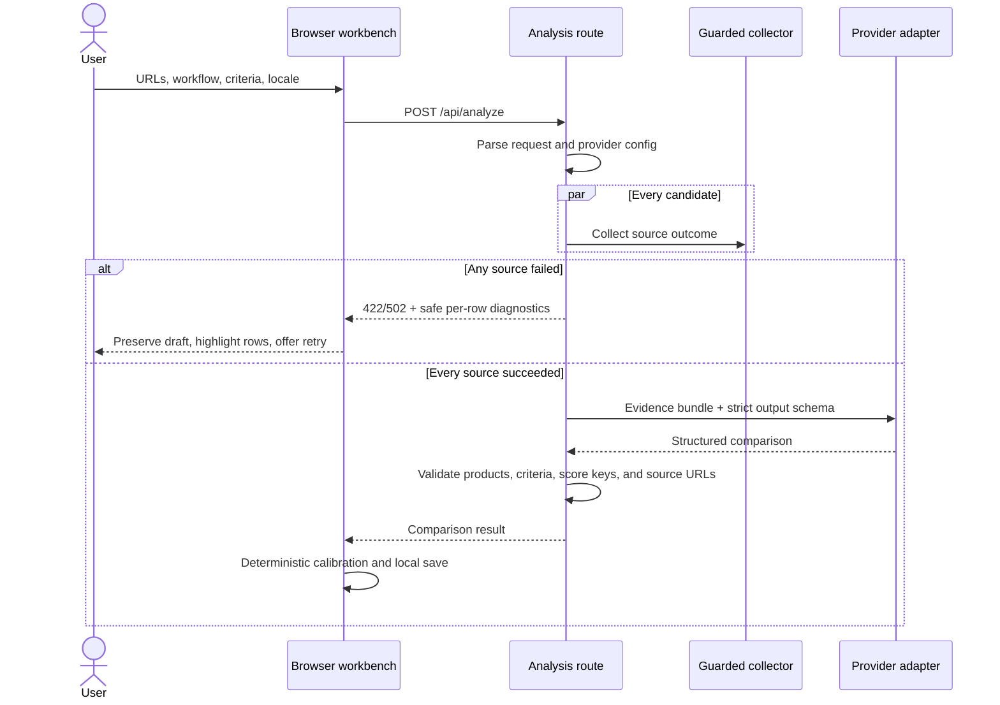
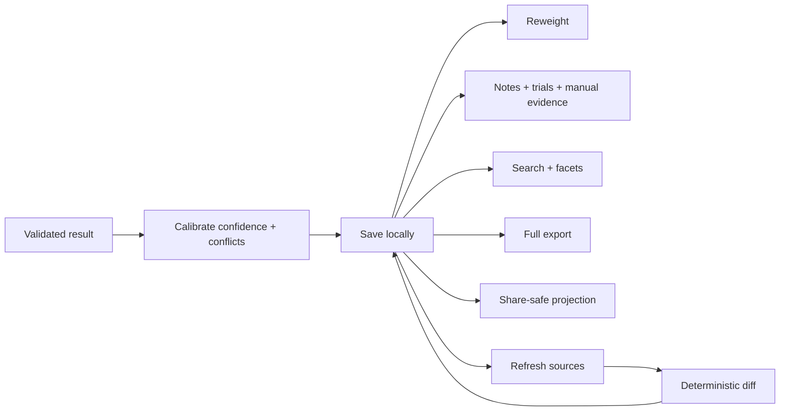

# FitLens architecture

This document is a map of the current codebase: where responsibilities live,
which boundaries matter, and what must remain true when the product changes.

## Contents

1. [System shape](#system-shape)
2. [Module ownership](#module-ownership)
3. [Live analysis flow](#live-analysis-flow)
4. [Local report flow](#local-report-flow)
5. [Core invariants](#core-invariants)
6. [Security boundaries](#security-boundaries)
7. [Persistence](#persistence)
8. [Test layers](#test-layers)
9. [Deliberate non-goals](#deliberate-non-goals)

## System shape

FitLens has four practical layers. Dependencies point down; deterministic
domain modules do not import the UI or route.

```text
┌──────────────────────────────────────────────────────────────┐
│ Browser UI                                                   │
│ app/page.tsx · components/compare-workbench.tsx              │
├──────────────────────────────────────────────────────────────┤
│ Request orchestration                                        │
│ app/api/analyze/route.ts · lib/analyze-request.ts             │
├──────────────────────────────────────────────────────────────┤
│ External adapters                                             │
│ lib/source.ts · lib/source-diagnostics.ts                     │
│ lib/model-provider.ts · lib/analyzer.ts                       │
├──────────────────────────────────────────────────────────────┤
│ Deterministic domain + portable data                          │
│ scoring · evidence · confidence · conflicts · privacy · diff │
│ freshness · redaction · report · research-library · types    │
└──────────────────────────────────────────────────────────────┘
```

The browser is intentionally stateful: it owns draft criteria, local history,
notes, trial results, and reweighting. The server is intentionally narrow: it
validates a request, collects sources, calls the configured model, validates the
structured response, and returns it.

## Module ownership

| Concern | Owner |
| --- | --- |
| Page metadata and root document | `app/layout.tsx` |
| Workbench state and user interactions | `components/compare-workbench.tsx` |
| Public analysis endpoint and status codes | `app/api/analyze/route.ts` |
| Request schema and URL-list validation | `lib/analyze-request.ts` |
| URL policy, DNS checks, redirects, byte caps, page/GitHub collection | `lib/source.ts` |
| Per-candidate collection outcomes and safe public failures | `lib/source-diagnostics.ts` |
| Provider env resolution, client construction, normalized provider errors | `lib/model-provider.ts` |
| Model prompt, response schema, and response cross-field validation | `lib/analyzer.ts` |
| Criteria templates and legacy criteria migration | `lib/criteria.ts` |
| Weighted fit calculation | `lib/scoring.ts` |
| Manual evidence merge and refresh preservation | `lib/evidence.ts` |
| Evidence age classification | `lib/freshness.ts` |
| Deterministic confidence calibration | `lib/confidence.ts` |
| Opposing-claim detection | `lib/conflicts.ts` |
| Privacy risk calibration | `lib/privacy.ts` |
| Report-to-report change calculation | `lib/diff.ts` |
| Share-safe projection | `lib/redaction.ts` |
| Portable schemas, migrations, and evidence coverage | `lib/report.ts` |
| Local search index, summaries, and facets | `lib/research-library.ts` |
| Shared data contracts | `lib/types.ts` |
| User-facing Chinese and English strings | `lib/i18n.ts` |

If a new feature is deterministic and useful outside React, it belongs in a
`lib/` module with direct tests. The workbench should coordinate that logic, not
reimplement it.

## Live analysis flow



Source collection is all-or-nothing for analysis. Partial evidence is useful
for diagnostics, but it is not sent to the model because that would create an
uneven comparison without making the omission obvious in the final ranking.

## Local report flow

The model is not involved when a user changes weights, searches saved reports,
adds notes, records trial results, exports a report, or compares revisions.



## Core invariants

These are the contracts most likely to cause subtle errors if weakened:

1. A request and result contain 2–8 products. Every requested source produces
   exactly one returned product in the same order.
2. Criteria keys are stable. A model response must return each requested key
   exactly once; labels and weights are normalized back to the user's input.
3. Every dimension score map contains every product name exactly once. The
   recommendation and dimension winners must reference returned products.
4. Evidence and pricing links are normalized to URLs collected for that
   product. A model cannot introduce an arbitrary citation URL.
5. Missing disclosure remains unknown. It cannot improve privacy risk or
   confidence.
6. Manual evidence survives refreshes and is never duplicated when the model
   later returns the same claim.
7. Fit, confidence, and coverage stay separate. Reweighting fit must not change
   confidence or evidence coverage.
8. Share-safe exports are derived copies. They do not mutate the local report
   and do not contain context, notes, trials, revisions, criterion hints, or
   manual evidence.
9. API keys, provider names, models, and provider base URLs never enter report
   history or exports.
10. Old portable reports are migrated at the schema boundary rather than
    scattered through UI code.

## Security boundaries

### Remote source collection

`lib/source.ts` treats every submitted URL and redirect target as hostile.

- Only HTTP and HTTPS URLs without embedded credentials are accepted.
- DNS is resolved before each request. Any private, loopback, link-local,
  reserved, multicast, or unspecified IPv4/IPv6 answer rejects the host.
- Redirects are manual and capped at five hops.
- Authorization is removed on cross-origin redirects.
- Content type is allowlisted for each route.
- Actual streamed bytes are capped; `Content-Length` alone is not trusted.
- GitHub metadata and README requests use the same guarded transport.

The remaining DNS-rebinding gap is explicit: Node's connection lookup happens
after the policy lookup. FitLens is intended to run as an unprivileged local
process. A public deployment would also need outbound firewall or proxy policy.

### Model boundary

The provider adapter accepts OpenAI or an opt-in compatible Responses endpoint.
Remote base URLs require HTTPS; unauthenticated HTTP is allowed only on
loopback. Provider errors are mapped to stable public codes without retaining
upstream bodies, stack traces, or secret-bearing messages.

The model sees the user's workflow, criteria, and collected public source
material. It does not receive browser history, saved notes, trial results, or
other reports.

### Browser boundary

Keys entered in the UI use `sessionStorage`. Reports, notes, and templates use
`localStorage`. Neither is a secure secret vault; the boundary is appropriate
for a local single-user tool, not a shared hosted application.

## Persistence

| Location | Owner | Contents |
| --- | --- | --- |
| `fitlens-report-history-v1` in `localStorage` | Workbench | Up to 50 reports, revisions, notes, trials, and manual evidence |
| Template storage in `localStorage` | Workbench | User-created criteria templates |
| Locale storage in `localStorage` | Workbench | Current language preference |
| API key in `sessionStorage` | Workbench | Current-tab model key override |
| `.env.local` | Local Next.js server | Provider, model, API key, optional GitHub token |
| Exported `.json` / `.md` | User | Portable backup or share-safe report |

Browser history deliberately keeps its existing storage key. Schema migration
happens while loading, so older local reports do not require a separate data
migration command.

## Test layers

| Layer | Files | What it proves |
| --- | --- | --- |
| Domain | `test/{scoring,evidence,confidence,conflicts,privacy,diff,freshness}.test.ts` | Deterministic decision logic and edge cases |
| Portable data | `test/{report,redaction,research-library}.test.ts` | Migration, import safety, redaction, local indexing |
| External boundaries | `test/{source,source-diagnostics,model-provider}.test.ts` | URL/DNS/redirect policy, public errors, provider config without live calls |
| Product contract | `test/{criteria,i18n}.test.ts` | Stable criteria and bilingual dictionary parity |
| Build contract | `pnpm lint`, `pnpm exec tsc --noEmit`, `pnpm build` | Static correctness and production compilation |

Network tests use injected DNS/fetch behavior. The fast test suite does not
depend on live websites, GitHub, or a model provider.

## Deliberate non-goals

FitLens is not currently:

- a general-purpose web crawler;
- a public multi-user SaaS or URL-fetching service;
- an account, team, or cloud-sync system;
- a replacement for a hands-on product trial;
- an objective product leaderboard;
- a guarantee that a vendor's public claims are true;
- a full archive of every source page and release over time.

Those boundaries keep the app useful as a local decision workspace. Features
that require hosted identity, shared persistence, or unrestricted crawling
should be treated as architectural changes rather than additions to the current
local-first model.
